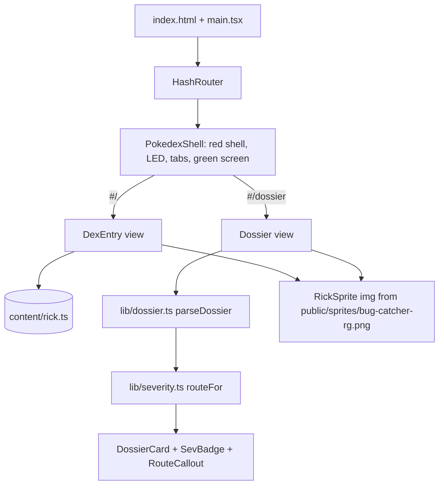
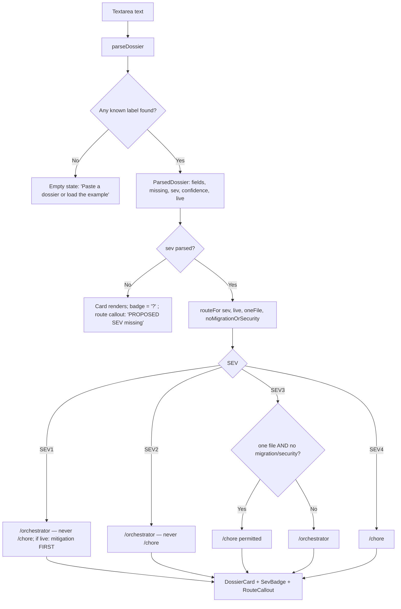
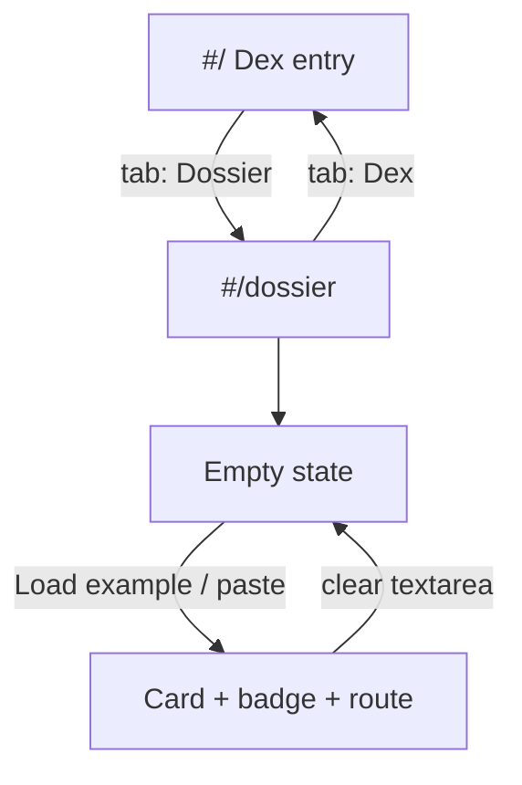

# 1 — Build the Bug Catcher Rick web app

**GitHub item:** https://github.com/Sfzmango/bug-catcher-rick (greenfield build — no issue; this plan is the founding document)

## Goal

Ship a public, Pokédex-styled single-page web app that is the "Dex entry" for **Bug Catcher Rick**, the read-only bug-diagnosis agent from Maung's Agentic Toolbelt. The app has two views — the **Dex entry** (trainer card, tool grants, auto-detect steps, the 10-field dossier "moveset", cardinal rules, circuit-breaker table, token-budget meter) and a **Dossier** viewer that parses a pasted plain-text dossier and renders it as a Pokédex card with a SEV gym badge and the forced fix route. It exists so developers evaluating or using the toolbelt can grasp, in under a minute, what Rick does, what he refuses to do, and how a diagnosis flows into `/orchestrator` or `/chore`. *(A third view, a scripted Rick-vs-adversary Battle simulator, was built and then cut at the owner's request during implementation — see "Decisions locked in this plan".)* Client-only, deployed to GitHub Pages from GitHub Actions.

## Foundation

Discovery was answered by the developer before planning; every catalog line is recorded here.

- **Product framing**
  - Target user — developers evaluating or using Maung's Agentic Toolbelt (public showcase).
  - Core job — be the canonical, memorable "Dex entry" for Bug Catcher Rick: what he does, what he never does, and how a dossier routes to a fix.
  - v1 success — both views render on GitHub Pages; a real dossier pasted from an `@bug-catcher-rick` run renders as a card with the correct SEV badge and route.
- **Technical foundation**
  - Stack — Vite + React 18 + TypeScript, client-only static SPA. React Router (`HashRouter`, GitHub-Pages-safe). Vitest + `@testing-library/react` for unit/component tests. Playwright available for local live verification.
  - Data — none. All copy lives in a typed content module transcribed at build time from the two toolbelt markdown files; nothing is fetched at runtime.
  - Identity — n/a — no auth; public static site.
- **Delivery & ops**
  - Deployment target — GitHub Pages via GitHub Actions (`actions/deploy-pages`). Vite `base` = `/bug-catcher-rick/`.
  - Scale & NFRs — static single-user page; responsive down to ~400px; visible focus states; `prefers-reduced-motion` respected; no backend, so availability is Pages' availability.
  - Compliance — n/a — no user data, no PII, no payments.
- **Constraints & scaffolding**
  - Constraints — npm, Node 20. MIT license. No Pokémon names in the UI. *(As-built, owner-requested: the plan originally required an original 24x24 pixel-art Rick and no franchise sprites; the owner instead asked for the real Gen 1 Bug Catcher trainer sprite, which is vendored under `public/sprites/` with a credits notice in README — see "Decisions locked in this plan".)*
  - Repo bootstrap — git already initialised (`be13359 chore: seed repository`); single package; scaffold via `npm create vite@latest` (react-ts template), then hand-trim.
  - v1 defer list — backend, auth, analytics, dark theme, any agent other than Rick.
- **Minimal CLAUDE.md seed**

  ```markdown
  # CLAUDE.md — bug-catcher-rick

  Pokédex-styled static SPA for Bug Catcher Rick (Vite + React 18 + TypeScript, HashRouter).
  Client-only; deployed to GitHub Pages by `.github/workflows/deploy.yml`.

  ## Commands
  - `npm run dev` — local dev server
  - `npm test` — Vitest (unit + component)
  - `npm run typecheck` — `tsc --noEmit`
  - `npm run build` — `tsc -b && vite build` (base `/bug-catcher-rick/`)
  - `npm run e2e` — Playwright smoke (local only; not in CI)

  ## Cardinal rules
  - All Rick copy lives in `src/content/*.ts`, transcribed from the toolbelt's
    `agents/bug-catcher-rick.md` + `skills/bug-catcher/SKILL.md`. Never fetch at runtime.
  - `src/lib/*` is pure and framework-free; every exported function has a test.
  - The vendored Gen 1 Bug Catcher trainer sprite in `public/sprites/` (credited in README) is the
    only franchise asset; add no other Pokémon sprites, names, or assets.
  - No AI-assistant attribution in commits, PRs, or files.
  ```

- **Scaffold command** (recommendation only — rides the developer's normal commit/gate flow):

  ```sh
  npm create vite@latest . -- --template react-ts
  npm i react-router-dom
  npm i -D vitest jsdom @testing-library/react @testing-library/jest-dom @testing-library/user-event @playwright/test
  ```

- **Next step** — after the implementation commit lands, run `/agentic-onboard` to crystallise `CLAUDE.md` from the built tree (the seed above is the starting point).

## Architecture

The app is a static SPA with two routes behind a `HashRouter` (`#/`, `#/dossier`), wrapped in a single `PokedexShell` layout that draws the red shell, the top LED cluster, the tab navigation, and a green "screen" region into which the active view renders. All prose — trainer card, tool grants, auto-detect steps, the 10 dossier fields, cardinal rules, circuit breakers, token budget, and the example dossier — is data in `src/content/*.ts`, typed so a missing or misspelled field is a compile error. Components are presentational: they take content objects and render; they hold no domain logic.

Domain logic lives in two pure, framework-free modules with unit tests. `src/lib/dossier.ts` parses the agent's plain-text dossier format (a known label, then ` — ` or `:`, then a value that may run onto following lines) into a typed `ParsedDossier`, and extracts the SEV, the CONFIDENT/HYPOTHESIS tag, and a `live` flag from the PROD MITIGATION field. `src/lib/severity.ts` turns a SEV plus two SEV3-only qualifiers (one file? no migration/security surface?) into a `RouteDecision` that encodes the skill's rubric exactly: SEV1/SEV2 → `/orchestrator` (never `/chore`; SEV1 live → mitigation first), SEV3 → `/orchestrator` unless both qualifiers hold, SEV4 → `/chore`. The Dossier view is a thin composition: textarea → `parseDossier` → `routeFor` → `DossierCard`.


The Rick sprite is the vendored 56x56 Gen 1 Bug Catcher trainer PNG (`public/sprites/bug-catcher-rg.png`) rendered by an `` with `image-rendering: pixelated`, sized to the box each placement needs. Styling is plain CSS with custom properties for the palette and CSS modules per component; no CSS framework. Fonts load from Google Fonts via `<link>` tags in `index.html`.

### Application structure



### Dossier parse → route flow



Parser contract (`src/lib/dossier.ts`):

```ts
export const DOSSIER_FIELDS = [
  'SYMPTOM', 'REPRODUCTION', 'ROOT CAUSE', 'EVIDENCE CHAIN', 'PROPOSED SEV',
  'FIX DIRECTION', 'REGRESSION TEST', 'BLAST RADIUS', 'PROD MITIGATION', 'OPEN QUESTIONS',
] as const;
export type DossierField = (typeof DOSSIER_FIELDS)[number];
export type Confidence = 'CONFIDENT' | 'HYPOTHESIS';
export interface ParsedDossier {
  fields: Partial<Record<DossierField, string>>;
  missing: DossierField[];
  sev: Sev | null;               // from PROPOSED SEV: SEV tokens (highest wins), else a bare level digit, else Critical/High/Moderate/Low
  confidence: Confidence | null; // from ROOT CAUSE
  live: boolean;                 // PROD MITIGATION present and not "none" / "n/a" / "not live"
}
export function parseDossier(text: string): ParsedDossier;
```

Line grammar: a line whose leading text (case-insensitive, internal whitespace collapsed) equals a known label, followed by optional spaces and either `—`, `-`, or `:`, starts that field; the remainder of the line is the first value line. Every following line until the next label line is appended to the current field (trimmed, joined with `\n`, then the whole value trimmed). Lines before the first label are ignored. A fenced code block wrapper (```) is stripped if present so a dossier copied verbatim from the agent's output parses.

Routing contract (`src/lib/severity.ts`):

```ts
export type Sev = 1 | 2 | 3 | 4;
export interface RouteInput { sev: Sev; live?: boolean; oneFile?: boolean; noMigrationOrSecurity?: boolean }
export interface RouteDecision {
  sev: Sev;                   // echoed so the UI branches on the level, not on the reason prose
  route: '/orchestrator' | '/chore';
  label: '/orchestrator' | '/chore' | '/chore permitted';  // display label (review follow-up)
  choreAllowed: boolean;      // false for SEV1/SEV2 always
  mitigationFirst: boolean;   // true only for SEV1 && live
  reason: string;             // one sentence quoting the rubric
}
export function routeFor(input: RouteInput): RouteDecision;
export function sevMeta(sev: Sev): { name: 'Critical' | 'High' | 'Moderate' | 'Low'; badge: string; cssVar: string };
```

### Decisions locked in this plan

- **Router** — `HashRouter`. Avoids a `404.html` rewrite hack on GitHub Pages; URLs are `/bug-catcher-rick/#/dossier`. A `*` catch-all redirects unknown hashes (including the removed `#/battle`) to `#/`.
- **SEV3 qualifiers are user-supplied, not inferred.** Guessing "one file" from BLAST RADIUS prose would be a fabricated certainty — exactly what Rick forbids. The Dossier view shows two checkboxes (unchecked by default → `/orchestrator`) only when SEV3 is parsed.
- **Styling = CSS custom properties + CSS modules.** No Tailwind or component library; the visual identity is bespoke enough that a framework would fight it.
- **Playwright is local-only.** One smoke spec ships under `e2e/` with `npm run e2e`; CI runs `npm test` and `npm run build` only, to keep the PR gate fast and browser-free.
- **Real Bug Catcher sprite instead of an original one (owner-requested change, as-built).** The plan specified an original 24x24 canvas-drawn sprite and no franchise sprites. During implementation the owner asked to "use the actual bug catcher Rick sprite"; the Gen 1 Red/Green Bug Catcher trainer sprite is vendored under `public/sprites/` — never hotlinked — rendered by an `` with `image-rendering: pixelated`, credited in README (© Nintendo / Game Freak / Creatures, non-commercial fan use, sourced from the Bulbapedia archives), and explicitly excluded from the MIT grant in `LICENSE` (review follow-up). An unused Yellow variant was vendored briefly and then dropped in review. `src/content/sprite.ts` and the canvas renderer were removed.
- **Type sizes, as-built (review follow-up).** Press Start 2P is 14px for the H1, 12px for H2 and the route label, 11px for the shell title, and 10px for every meaning-bearing label (tabs, dossier field labels, chips, the CONFIDENT | HYPOTHESIS tag, table headers, meter marks, buttons, badge captions); only aria-hidden decorative eyebrows (move index, PP pips, `[x]` marks) are 9px. The first build used 7–9px for several of these; raised in review.
- **Parser tolerance, as-built (review follow-up).** Labels may be wrapped in Markdown bold or preceded by a `-`/`*` bullet (`**SYMPTOM** — x`, `**SYMPTOM:** x`, `- SYMPTOM — x`), a label with an empty value counts as missing, a code fence is stripped even when a preamble line precedes it, the bare-digit SEV shape is read from the first line only, a bulleted PROD MITIGATION list is live (only none / n/a / not-live phrases or a dash-only value are not), and the empty state shows a one-line shape hint when text is present but nothing parsed. SEV badge colourways are `--sev-1..4` (+`-deep`) tokens in `tokens.css`, referenced through `sevMeta().cssVar`.
- **Battle view removed (owner-requested scope cut, as-built).** The plan originally included a `#/battle` scripted Rick-vs-adversary debate simulator (a `useReducer` state machine with four scenarios, one per adversary verdict). It was implemented, verified, and then cut at the repo owner's explicit request ("remove battle") before the implementation commit landed. The app ships exactly two views; the adversary is mentioned only in the transcribed prose. Nothing Battle-specific remains in the tree.

## Files to edit

- `/README.md` — add the live URL, the route list, and a one-line pointer to `docs/plans/`.
- `/.gitignore` — already covers `node_modules/`, `dist/`, `test-results/`, `playwright-report/`; add `coverage/`.

## Files to add

Tooling and config:

- `package.json` — scripts + deps (see "npm scripts" and "Libraries").
- `package-lock.json` — committed; CI uses `npm ci`.
- `.nvmrc` — `20`.
- `index.html` — root element, Google Fonts `<link>`s (Press Start 2P, IBM Plex Sans, IBM Plex Mono), meta viewport, theme-color `#c8102e`.
- `vite.config.ts` — `base: '/bug-catcher-rick/'`, `@vitejs/plugin-react`, Vitest `test` block (`environment: 'jsdom'`, `setupFiles: ['src/test/setup.ts']`, `include: ['src/**/*.test.{ts,tsx}']`).
- `tsconfig.json`, `tsconfig.app.json`, `tsconfig.node.json` — strict TS, `noUncheckedIndexedAccess`.
- `playwright.config.ts` — `webServer: npm run preview`, `baseURL: http://localhost:4173/bug-catcher-rick/`. The `e2e` script is `npm run build && playwright test` so the smoke always runs against the current tree (`vite preview` serves `dist/` as-is).
- `.github/workflows/ci.yml` — PR gate (see "CI workflow outline").
- `.github/workflows/deploy.yml` — build + Pages deploy on push to `main`.
- `public/favicon.svg` — a 16x16 flat icon in the Game Boy palette (original).
- `public/sprites/bug-catcher-rg.png` — vendored Gen 1 Bug Catcher trainer sprite (Red/Green monochrome). Sourced from the Bulbapedia archives; credited in README and carved out of the MIT grant in `LICENSE`.

Entry and shell:

- `src/main.tsx` — mounts `<App />` in `StrictMode`.
- `src/App.tsx` — `HashRouter` + `Routes`; `PokedexShell` as the layout route.
- `src/components/PokedexShell.tsx` + `.module.css` — red shell frame, LED cluster, tab nav (`NavLink`s with `aria-current`), green screen slot, footer link to the toolbelt repo.
- `src/styles/tokens.css` — palette custom properties (`--shell #c8102e`, `--shell-deep #8f0a20`, `--gb-0 #0f380f`, `--gb-1 #306230`, `--gb-2 #8bac0f`, `--gb-3 #9bbc0f`, `--cream #f6f1df`, `--ink #1f1a14`, `--sev-1..4` + `-deep` badge colourways), font stacks, spacing scale, focus ring.
- `src/styles/global.css` — reset, body fonts, focus-visible outline, `@media (prefers-reduced-motion: reduce)` kill-switch for all animation.

Content (transcribed at build time from `agents/bug-catcher-rick.md` and `skills/bug-catcher/SKILL.md`; never fetched):

- `src/content/types.ts` — `TrainerCard`, `ToolGrant`, `AutoDetectStep`, `Move` (dossier field), `CardinalRule`, `CircuitBreaker`, `TokenBudget`, `SevRubricRow`.
- `src/content/rick.ts` — trainer card (name, class "Bug Catcher", role, one-paragraph description, "read-only" badge); `toolGrants` (Read, Bash, Grep, WebFetch, `mcp__github__issue_read`, `mcp__github__pull_request_read` granted; Edit, Write, `git push` denied); `autoDetectSteps` (3); `moves` (the 10 dossier fields with one-line descriptions, ROOT CAUSE carrying the CONFIDENT/HYPOTHESIS tag); `cardinalRules` (6, from the agent file); `circuitBreakers` (7 rows); `tokenBudget` `{ cap: 100_000, checkpoint: 0.6, halt: 0.8 }`; `sevRubric` (4 rows from the skill).
- `src/content/exampleDossier.ts` — one realistic plain-text dossier (SEV1, CONFIDENT, live) used by the "Load example" button and by tests.

Pure logic:

- `src/lib/dossier.ts` — `parseDossier`, `DOSSIER_FIELDS`, `ParsedDossier`.
- `src/lib/severity.ts` — `routeFor`, `sevMeta`, `Sev`.

Components (presentational):

- `src/components/RickSprite.tsx` + `.module.css` — `` of the vendored sprite; props `size` (box px, default 96), `label` (alt text), `idle`; `image-rendering: pixelated`; idle bob via CSS class unless reduced motion.
- `src/components/Screen.tsx` + `.module.css` — green screen panel with scanline overlay and inner bezel (props: `children`, `className`).
- `src/components/DialogueBox.tsx` + `.module.css` — cream box with ink text (an optional blinking "▼" continue arrow is supported; static under reduced motion).
- `src/components/TokenMeter.tsx` + `.module.css` — 100k budget bar with tick marks at 60% ("checkpoint") and 80% ("halt"); `role="meter"`.
- `src/components/ToolGrants.tsx` — two-column list; denied items rendered with `<s>` plus visually-hidden "denied" text so the strike-through is not colour-only.
- `src/components/MoveList.tsx` — the 10 dossier fields as a numbered moveset with PP-style pips purely decorative.
- `src/components/CircuitBreakerTable.tsx` — `<table>` with `<caption>`, horizontally scrollable under 480px.
- `src/components/SevBadge.tsx` + `.module.css` — gym-badge SVG with SEV number; four colourways.
- `src/components/RouteCallout.tsx` — renders a `RouteDecision` (route, mitigation-first warning, reason).
- `src/components/DossierCard.tsx` + `.module.css` — the Pokédex card: sprite, symptom headline, badge, confidence chip, live chip, the 10 fields in order with missing ones shown as "— not provided —".

Views:

- `src/views/DexEntry.tsx` + `.module.css`
- `src/views/Dossier.tsx` + `.module.css`

Tests:

- `src/test/setup.ts` — `@testing-library/jest-dom/vitest` + Testing Library cleanup.
- `src/lib/dossier.test.ts`
- `src/lib/severity.test.ts`
- `src/views/DexEntry.test.tsx` — pins acceptance criterion 3's counts (added in review).
- `src/views/Dossier.test.tsx`
- `e2e/smoke.spec.ts` — loads each route, asserts the heading, and asserts the sprite `` where it appears (local only).

### npm scripts

```json
{
  "dev": "vite",
  "build": "tsc -b && vite build",
  "preview": "vite preview",
  "typecheck": "tsc -b --noEmit",
  "test": "vitest run",
  "test:watch": "vitest",
  "e2e": "npm run build && playwright test"
}
```

`npm test` maps to `vitest run` so CI's `npm test` is non-interactive.

### CI workflow outline

`.github/workflows/ci.yml` — trigger `pull_request` only, so each PR commit is verified exactly once (as-built: the plan also listed `push` to non-`main` branches, which double-ran the gate; dropped in review); workflow-level `permissions: { contents: read }` for parity with `deploy.yml` (added in review round 5):

1. `actions/checkout@v4`
2. `actions/setup-node@v4` with `node-version-file: .nvmrc`, `cache: npm`
3. `npm ci`
4. `npm run typecheck`
5. `npm test`
6. `npm run build`

`.github/workflows/deploy.yml` — trigger `push` to `main` and `workflow_dispatch`; workflow-level `permissions: { contents: read }`; the `build` job re-declares `permissions: { contents: read, pages: read }` (`actions/configure-pages` reads the Pages config and 403s without `pages: read`; it runs `npm ci` on third-party code and never needs the OIDC token) and `pages: write` + `id-token: write` are granted on the `deploy` job only; `concurrency: { group: pages, cancel-in-progress: false }` so an in-flight production deploy is never aborted (queued runs still coalesce). *(as-built: the plan first had `cancel-in-progress: true` and workflow-level write permissions; tightened in review, then `pages: read` restored on `build` in review round 4.)*

- job `build`: checkout → setup-node (same as above) → `npm ci` → `npm test` → `npm run build` → `actions/configure-pages@v5` → `actions/upload-pages-artifact@v3` with `path: dist`.
- job `deploy`: `needs: build`, `environment: { name: github-pages, url: ${{ steps.deployment.outputs.page_url }} }`, `actions/deploy-pages@v4` (`id: deployment`).

Pages must be set to "Source: GitHub Actions" in repo settings once (see "Follow-up at merge time"); until then the deploy job fails harmlessly.

## UI/UX

Single theme, Gen-1 Pokédex. The whole app lives inside a red shell (`#c8102e`, bevel `#8f0a20`) with a top-left LED cluster (one large blue-ish lens, three small LEDs) and a green screen (`#9bbc0f` background, `#0f380f` ink) as the main content surface. Cream (`#f6f1df`) dialogue boxes with `#1f1a14` text carry prose. Press Start 2P is used only for headings, tab labels, badges, field labels, and chips at 10–14px (decorative eyebrows such as the move index, PP pips, and the `[x]` grant marks may sit at 9px); IBM Plex Sans is body; IBM Plex Mono is used for the dossier text and code-like values. All interactive elements have a 3px `#0f380f` `focus-visible` outline offset 2px on light and green surfaces and a `#f6f1df` outline on the red chrome only (header, tab nav, footer — the `on-shell` hook lives on those three elements, never on the app root). Every animation (sprite bob, scanline drift) is disabled under `prefers-reduced-motion: reduce`.

### Screen flow



### Dex entry (`#/`) — wireframe

```text
+------------------------------------------------------------------+
| (o) . . .                       BUG CATCHER RICK        No. 001  |  <- red shell header
|  [ DEX ]  [ DOSSIER ]                                             |  <- tabs (NavLink)
+------------------------------------------------------------------+
| +--------------------------------------------------------------+ |
| |  +--------+  BUG CATCHER RICK          class: Bug Catcher     | |  <- green screen
| |  | sprite |  Type: DIAGNOSIS / READ-ONLY                       | |
| |  | 24x24  |  "Finds and diagnoses bugs in any project..."      | |
| |  +--------+                                                    | |
| |                                                                | |
| |  TOOL GRANTS                    AUTO-DETECT                    | |
| |   [x] Read        [x] WebFetch   1. CLAUDE.md + CLAUDE.local.md| |
| |   [x] Bash        [x] gh issue   2. Language + framework +     | |
| |   [x] Grep        [x] gh PR         test runner                | |
| |   ~~Edit~~  ~~Write~~  ~~git push~~  3. Plan / roadmap files   | |
| |                                                                | |
| |  MOVESET (dossier fields)                                      | |
| |   01 SYMPTOM         02 REPRODUCTION   03 ROOT CAUSE [C|H]     | |
| |   04 EVIDENCE CHAIN  05 PROPOSED SEV   06 FIX DIRECTION        | |
| |   07 REGRESSION TEST 08 BLAST RADIUS   09 PROD MITIGATION      | |
| |   10 OPEN QUESTIONS                                            | |
| |                                                                | |
| |  TOKEN BUDGET  [##########|#####|      ] 100k                  | |
| |                          60%   80%                             | |
| |                       checkpoint halt                          | |
| +--------------------------------------------------------------+ |
| +-- cream dialogue box -----------------------------------------+ |
| |  CARDINAL RULES  (6 numbered)                                  | |
| |  CIRCUIT-BREAKERS  | Failure | Action |  (7 rows, scrollable)  | |
| +--------------------------------------------------------------+ |
+------------------------------------------------------------------+
```

At ~400px the two-column blocks (tool grants / auto-detect, moveset grid) collapse to one column; the circuit-breaker table scrolls horizontally inside its box.

### Dossier (`#/dossier`) — wireframe

```text
+------------------------------------------------------------------+
|  [ DEX ]  [ DOSSIER ]                                             |
+------------------------------------------------------------------+
| +-- cream ------------------------------------------------------+ |
| |  Paste a dossier (LABEL — value or LABEL: value per field)     | |
| |  +----------------------------------------------------------+ | |
| |  | SYMPTOM — approval inbox 500s for newly-invited members   | | |
| |  | REPRODUCTION — GET /approvals as a member invited after…  | | |
| |  | ...                                          (mono, 12 rows)| |
| |  +----------------------------------------------------------+ | |
| |  [ LOAD EXAMPLE ]  [ CLEAR ]                                   | |
| +--------------------------------------------------------------+ |
| +-- green screen: Pokédex card ---------------------------------+ |
| |  +--------+  approval inbox 500s for newly-invited members    | |
| |  | sprite |  (SEV1 badge)  CONFIDENT   LIVE                   | |
| |  +--------+                                                   | |
| |  ROUTE ▶ /orchestrator — never /chore.                        | |
| |          SEV1 is live: apply the mitigation FIRST (gated).    | |
| |  ------------------------------------------------------------ | |
| |  SYMPTOM         ...                                          | |
| |  REPRODUCTION    ...                                          | |
| |  ROOT CAUSE      ...                                          | |
| |  ...             (10 rows; missing → "— not provided —")      | |
| |  MISSING: OPEN QUESTIONS                                      | |
| +--------------------------------------------------------------+ |
+------------------------------------------------------------------+
```

When SEV3 is parsed, two checkboxes appear above the route callout: "Fix is genuinely one file" and "No migration or security surface". Both must be checked for the callout to switch from `/orchestrator` to "/chore permitted". States: **empty** (no label found → a dialogue box prompting to paste or load the example; the card is not rendered), **partial** (some fields missing → card renders, missing list shown, badge "?" if SEV missing), **complete**. Parsing runs synchronously on every change; there is no loading state.

## Migrations

None — client-only static site.

## Libraries

Runtime:

- `react` ^18.3, `react-dom` ^18.3
- `react-router-dom` ^7 (`HashRouter`)

Dev:

- `vite` (latest stable at scaffold time), `@vitejs/plugin-react`
- `typescript` ~5.x
- `vitest` ^4, `jsdom` ^26 — *(as-built: the plan said `^3`; vitest 3 pulled a moderate `@vitest/mocker` advisory, so the implementation pinned `^4`, which is clean under `npm audit` and works with Vite 6 unchanged.)*
- `@testing-library/react` ^16, `@testing-library/jest-dom` ^6, `@testing-library/user-event` ^14
- `@playwright/test` (local only)

Exact versions are pinned by `package-lock.json` at scaffold time; the majors above are the intent. No CSS framework, no state library, no icon library. Fonts are loaded from Google Fonts by `<link>`, not bundled.

## Test plan

`src/lib/dossier.test.ts`

- Happy path: the example dossier parses all 10 fields, `missing` is empty, `sev === 1`, `confidence === 'CONFIDENT'`, `live === true`.
- Both separators: `SYMPTOM — x` and `SYMPTOM: x` produce identical output; `REGRESSION TEST—x` (no spaces) also parses.
- Multi-line values: an EVIDENCE CHAIN spanning three lines joins with `\n` and stops at the next label.
- Missing fields: a dossier with only SYMPTOM and ROOT CAUSE lists the other eight in `missing`, in canonical order; a label with an empty value (`SYMPTOM —`) is missing, not provided.
- Paste shapes: `**SYMPTOM** — x`, `**SYMPTOM:** x`, and `- SYMPTOM — x` all parse; bulleted lines inside a value stay continuation lines.
- No labels at all → all 10 missing, `sev === null`.
- SEV extraction: `SEV2`, `SEV 2`, `SEV-2`, lowercase `sev2`; "SEV2, arguably SEV1" → 1 (higher wins — deliberate: under-triage is the costlier error, so "SEV3 (not SEV2)" is knowingly read as SEV2). Hand-written shapes: a bare `1`–`4`, and the rubric names Critical / High / Moderate / Low (names are consulted only when no token or digit is present, so "high-visibility" in prose cannot promote a tagged SEV3).
- A PROPOSED SEV that is present but unreadable ("unclear, needs triage") yields `sev: null`; the route callout then says the value could not be read and shows it, rather than claiming the line is missing.
- Confidence: HYPOTHESIS detected; neither present → `null`.
- Live flag: PROD MITIGATION "none" / "n/a" / "not a live bug" → `false` (also with trailing prose: "None; not a live bug."); a real mitigation sentence → `true`, including ones that start with "No workaround; …" or "Nothing yet; …" — a bare "No" is deliberately not a negation because the flag only ever adds a warning.
- Fenced input: a dossier wrapped in triple backticks parses the same as unwrapped.
- Case-insensitive labels: `Symptom —` works.

`src/lib/severity.test.ts`

- SEV1 not live → `/orchestrator`, `choreAllowed false`, `mitigationFirst false`.
- SEV1 live → `/orchestrator`, `mitigationFirst true`.
- SEV2 with `oneFile` and `noMigrationOrSecurity` both true → still `/orchestrator`, `choreAllowed false`.
- SEV3 default → `/orchestrator`.
- SEV3 with only `oneFile` → `/orchestrator`; with only `noMigrationOrSecurity` → `/orchestrator`; with both → `/chore`, `choreAllowed true`.
- SEV4 → `/chore`.
- `sevMeta` returns the four names and distinct badge strings.

`src/views/Dossier.test.tsx`

- Empty textarea shows the empty-state prompt and no card.
- "Load example" fills the textarea and renders a card with the SEV1 badge and the "mitigation FIRST" callout.
- Pasting a SEV3 dossier shows the two qualifier checkboxes; checking both switches the callout to "/chore permitted"; the callout is an `aria-live="polite"` region.
- Text with no recognisable label shows the empty state plus a one-line `LABEL — value` hint.

`e2e/smoke.spec.ts` (local only): each route loads and the `<h1>` matches; no horizontal page scroll at 400px and 375px on both routes (AC 9); an unknown hash such as `#/battle` redirects to `#/`; under emulated `prefers-reduced-motion: reduce` no element on either route has a running animation or transition, while the sprite does animate without the preference (AC 12); the Dossier textarea, both buttons, and the SEV3 checkboxes show the 3px ink focus ring while a tab shows the cream one (AC 10); the sprite `` is asserted on `#/` only, because the empty Dossier state has no sprite by design — the Dossier example flow in the same spec asserts it there. *(as-built deviation from "a `<canvas>` sprite is present" on every route.)*

Live verification (not available to the architect): after implementation, run `npm run e2e` and manually check the 400px layout in a browser; escalate findings to the developer.

## Blast radius

Greenfield: no existing users or data. Sensitive surfaces: none — no auth, no storage, no network calls at runtime. The only outward-facing surface is the GitHub Pages deployment, which is public by design. Rollback = revert the merge commit on `main`; the deploy workflow republishes the previous build on the next push. Content fidelity is the main correctness risk (transcription drift from the toolbelt's markdown); the content module is typed and the plan lists every source section, so drift is reviewable in the diff.

## Out of scope

- Any backend, API, auth, analytics, or persistence.
- Dark theme or theme switching.
- Other toolbelt agents or skills (no adversary Dex entry).
- Fetching the toolbelt's markdown at runtime, or any sync mechanism for content.
- Any Battle / debate simulator (cut by the owner during implementation).
- Running Playwright in CI.
- Pokémon names, cries, or any franchise asset beyond the vendored Bug Catcher trainer sprite.

## Acceptance criteria

Ships when:

1. `npm ci && npm run typecheck && npm test && npm run build` exit 0 on Node 20, and the same steps pass in the PR CI workflow.
2. Pushing to `main` builds and deploys to `https://sfzmango.github.io/bug-catcher-rick/`, and both hash routes load there with assets resolved under the `/bug-catcher-rick/` base.
3. The Dex entry shows the trainer card, six granted tools and three struck-through denied tools (with non-colour-only denial cues), the three auto-detect steps, the ten dossier fields in the agent's order with ROOT CAUSE carrying the CONFIDENT/HYPOTHESIS tag, six cardinal rules, the seven-row circuit-breaker table, and a 100k token meter with 60% checkpoint and 80% halt marks.
4. The Dossier view parses both `LABEL — value` and `LABEL: value`, multi-line values, case-insensitive labels, and fenced input; missing fields are listed rather than crashing.
5. The SEV badge and route callout match the rubric exactly: SEV1/SEV2 never show `/chore`; SEV1 live shows "mitigation first"; SEV3 shows `/chore permitted` only when both qualifiers are checked; SEV4 shows `/chore`.
6. "Load example" renders a complete SEV1 live card with zero missing fields.
7. All copy in the UI is traceable to `src/content/*.ts`, and every content string is present in one of the two toolbelt source files (paraphrase permitted for length, meaning preserved).
8. The sprite is the vendored Gen 1 Bug Catcher trainer PNG rendered pixelated, credited in README; no other Pokémon names or assets appear anywhere in the repo.
9. Layout holds at 400px wide with no horizontal page scroll (the circuit-breaker table scrolls within its own box).
10. Every interactive element has a visible `focus-visible` state, and all animation is disabled under `prefers-reduced-motion: reduce`.
11. No AI-assistant attribution appears in any commit, PR body, or file.

## Follow-up at merge time

- [ ] Repo settings → Pages → Source = **GitHub Actions** (one-time; the deploy job fails until this is set).
- [ ] Confirm the first `deploy.yml` run on `main` is green and the site loads at `https://sfzmango.github.io/bug-catcher-rick/`.
- [ ] Run `/agentic-onboard` in this repo to write `CLAUDE.md` from the built tree (start from the seed in `## Foundation`).
- [ ] Update `README.md` with the live URL once Pages is confirmed.
- [ ] In Maung's Agentic Toolbelt, add a "Dex entry" link to the app from `agents/bug-catcher-rick.md` or `docs/components.md` (separate PR in that repo; not part of this one).
