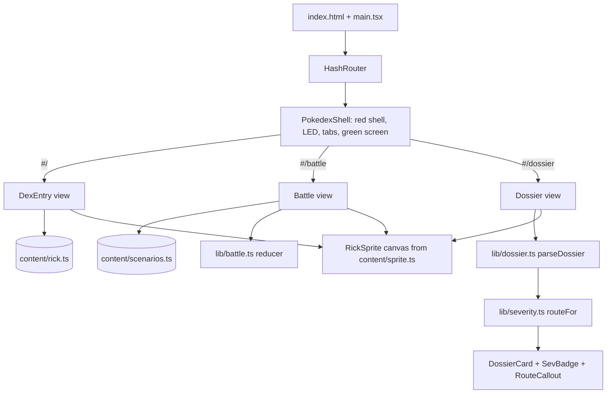
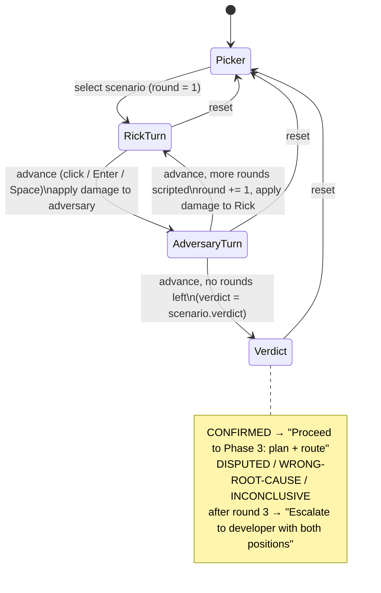
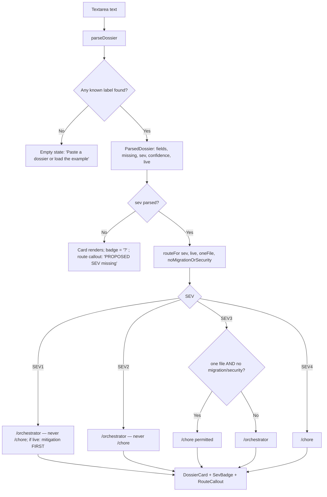
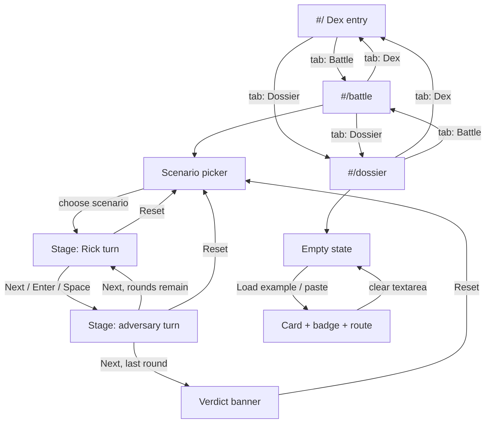

# 1 — Build the Bug Catcher Rick web app

**GitHub item:** https://github.com/Sfzmango/bug-catcher-rick (greenfield build — no issue; this plan is the founding document)

## Goal

Ship a public, Pokédex-styled single-page web app that is the "Dex entry" for **Bug Catcher Rick**, the read-only bug-diagnosis agent from Maung's Agentic Toolbelt. The app has three views — the **Dex entry** (trainer card, tool grants, auto-detect steps, the 10-field dossier "moveset", cardinal rules, circuit-breaker table, token-budget meter), a **Battle** simulator that steps through a scripted Rick-vs-adversary debate with HP bars and a verdict, and a **Dossier** viewer that parses a pasted plain-text dossier and renders it as a Pokédex card with a SEV gym badge and the forced fix route. It exists so developers evaluating or using the toolbelt can grasp, in under a minute, what Rick does, what he refuses to do, and how a diagnosis flows into `/orchestrator` or `/chore`. Client-only, deployed to GitHub Pages from GitHub Actions.

## Foundation

Discovery was answered by the developer before planning; every catalog line is recorded here.

- **Product framing**
  - Target user — developers evaluating or using Maung's Agentic Toolbelt (public showcase).
  - Core job — be the canonical, memorable "Dex entry" for Bug Catcher Rick: what he does, what he never does, and how a dossier routes to a fix.
  - v1 success — the three views render on GitHub Pages; a real dossier pasted from an `@bug-catcher-rick` run renders as a card with the correct SEV badge and route; the Battle can be played end-to-end with keyboard only.
- **Technical foundation**
  - Stack — Vite + React 18 + TypeScript, client-only static SPA. React Router (`HashRouter`, GitHub-Pages-safe). Vitest + `@testing-library/react` for unit/component tests. Playwright available for local live verification.
  - Data — none. All copy lives in a typed content module transcribed at build time from the two toolbelt markdown files; nothing is fetched at runtime.
  - Identity — n/a — no auth; public static site.
- **Delivery & ops**
  - Deployment target — GitHub Pages via GitHub Actions (`actions/deploy-pages`). Vite `base` = `/bug-catcher-rick/`.
  - Scale & NFRs — static single-user page; responsive down to ~400px; visible focus states; `prefers-reduced-motion` respected; no backend, so availability is Pages' availability.
  - Compliance — n/a — no user data, no PII, no payments.
- **Constraints & scaffolding**
  - Constraints — npm, Node 20. MIT license. No copyrighted Pokémon sprites and no Pokémon names in the UI; the only franchise framing is the "Bug Catcher" trainer-class idea plus an original 24x24 pixel-art Rick.
  - Repo bootstrap — git already initialised (`be13359 chore: seed repository`); single package; scaffold via `npm create vite@latest` (react-ts template), then hand-trim.
  - v1 defer list — backend, auth, analytics, dark theme, any agent other than Rick (the adversary appears only as the Battle opponent).
- **Minimal CLAUDE.md seed**

  ```markdown
  # CLAUDE.md — bug-catcher-rick

  Pokédex-styled static SPA for Bug Catcher Rick (Vite + React 18 + TypeScript, HashRouter).
  Client-only; deployed to GitHub Pages by `.github/workflows/deploy.yml`.

  ## Commands
  - `npm run dev` — local dev server
  - `npm test` — Vitest (unit + component)
  - `npm run typecheck` — `tsc --noEmit`
  - `npm run build` — `tsc -b && vite build` (base `/bug-catcher-rick/`)
  - `npm run e2e` — Playwright smoke (local only; not in CI)

  ## Cardinal rules
  - All Rick copy lives in `src/content/*.ts`, transcribed from the toolbelt's
    `agents/bug-catcher-rick.md` + `skills/bug-catcher/SKILL.md`. Never fetch at runtime.
  - `src/lib/*` is pure and framework-free; every exported function has a test.
  - No Pokémon sprites or Pokémon names in the UI. The sprite in `src/content/sprite.ts` is original.
  - No AI-assistant attribution in commits, PRs, or files.
  ```

- **Scaffold command** (recommendation only — rides the developer's normal commit/gate flow):

  ```sh
  npm create vite@latest . -- --template react-ts
  npm i react-router-dom
  npm i -D vitest jsdom @testing-library/react @testing-library/jest-dom @testing-library/user-event @playwright/test
  ```

- **Next step** — after the implementation commit lands, run `/agentic-onboard` to crystallise `CLAUDE.md` from the built tree (the seed above is the starting point).

## Architecture

The app is a static SPA with three routes behind a `HashRouter` (`#/`, `#/battle`, `#/dossier`), wrapped in a single `PokedexShell` layout that draws the red shell, the top LED cluster, the tab navigation, and a green "screen" region into which the active view renders. All prose — trainer card, tool grants, auto-detect steps, the 10 dossier fields, cardinal rules, circuit breakers, token budget, the example dossier, and the Battle scripts — is data in `src/content/*.ts`, typed so a missing or misspelled field is a compile error. Components are presentational: they take content objects and render; they hold no domain logic.

Domain logic lives in two pure, framework-free modules with unit tests. `src/lib/dossier.ts` parses the agent's plain-text dossier format (a known label, then ` — ` or `:`, then a value that may run onto following lines) into a typed `ParsedDossier`, and extracts the SEV, the CONFIDENT/HYPOTHESIS tag, and a `live` flag from the PROD MITIGATION field. `src/lib/severity.ts` turns a SEV plus two SEV3-only qualifiers (one file? no migration/security surface?) into a `RouteDecision` that encodes the skill's rubric exactly: SEV1/SEV2 → `/orchestrator` (never `/chore`; SEV1 live → mitigation first), SEV3 → `/orchestrator` unless both qualifiers hold, SEV4 → `/chore`. The Dossier view is a thin composition: textarea → `parseDossier` → `routeFor` → `DossierCard`.

The Battle view is a `useReducer` state machine driven by a scripted scenario. Each scenario is a list of up to three rounds; each round has a Rick turn (a dossier claim) and an adversary turn (a refutation or confirmation), each dealing HP damage to the opponent. Advancing (click, Enter, or Space on the focused stage) reveals the next turn; after the final scripted turn the verdict banner shows and the only remaining action is reset. Four scenarios ship, one per verdict: CONFIRMED, DISPUTED, WRONG-ROOT-CAUSE, INCONCLUSIVE — so every branch of the skill's debate loop is demonstrated, including the "3 rounds without convergence → escalate to the developer" exit.

The Rick sprite is an original 24x24 pixel map (an array of 24 strings, one character per palette index) rendered onto a `<canvas>` with image smoothing off and scaled by an integer factor. Styling is plain CSS with custom properties for the palette and CSS modules per component; no CSS framework. Fonts load from Google Fonts via `<link>` tags in `index.html`.

### Application structure



### Battle state machine



Reducer shape (`src/lib/battle.ts`):

```ts
type Phase = 'picker' | 'rick' | 'adversary' | 'verdict';
interface BattleState {
  phase: Phase;
  scenarioId: string | null;
  round: number;            // 1..3
  rickHp: number;           // 0..100
  adversaryHp: number;      // 0..100
  log: BattleLine[];        // revealed turns, oldest first
}
type BattleAction = { type: 'select'; scenarioId: string } | { type: 'advance' } | { type: 'reset' };
export function battleReducer(state: BattleState, action: BattleAction, scenarios: Scenario[]): BattleState;
```

`advance` is a no-op in `picker` and `verdict`, so a stray Enter cannot skip past the verdict.

### Dossier parse → route flow



Parser contract (`src/lib/dossier.ts`):

```ts
export const DOSSIER_FIELDS = [
  'SYMPTOM', 'REPRODUCTION', 'ROOT CAUSE', 'EVIDENCE CHAIN', 'PROPOSED SEV',
  'FIX DIRECTION', 'REGRESSION TEST', 'BLAST RADIUS', 'PROD MITIGATION', 'OPEN QUESTIONS',
] as const;
export type DossierField = (typeof DOSSIER_FIELDS)[number];
export type Confidence = 'CONFIDENT' | 'HYPOTHESIS';
export interface ParsedDossier {
  fields: Partial<Record<DossierField, string>>;
  missing: DossierField[];
  sev: Sev | null;               // from PROPOSED SEV: /SEV\s*-?\s*([1-4])/i, highest wins if several
  confidence: Confidence | null; // from ROOT CAUSE
  live: boolean;                 // PROD MITIGATION present and not "none" / "n/a" / "not live"
}
export function parseDossier(text: string): ParsedDossier;
```

Line grammar: a line whose leading text (case-insensitive, internal whitespace collapsed) equals a known label, followed by optional spaces and either `—`, `-`, or `:`, starts that field; the remainder of the line is the first value line. Every following line until the next label line is appended to the current field (trimmed, joined with `\n`, then the whole value trimmed). Lines before the first label are ignored. A fenced code block wrapper (```) is stripped if present so a dossier copied verbatim from the agent's output parses.

Routing contract (`src/lib/severity.ts`):

```ts
export type Sev = 1 | 2 | 3 | 4;
export interface RouteInput { sev: Sev; live?: boolean; oneFile?: boolean; noMigrationOrSecurity?: boolean }
export interface RouteDecision {
  route: '/orchestrator' | '/chore';
  choreAllowed: boolean;      // false for SEV1/SEV2 always
  mitigationFirst: boolean;   // true only for SEV1 && live
  reason: string;             // one sentence quoting the rubric
}
export function routeFor(input: RouteInput): RouteDecision;
export function sevMeta(sev: Sev): { name: 'Critical' | 'High' | 'Moderate' | 'Low'; badge: string; cssVar: string };
```

### Decisions locked in this plan

- **Router** — `HashRouter`. Avoids a `404.html` rewrite hack on GitHub Pages; URLs are `/bug-catcher-rick/#/battle`.
- **SEV3 qualifiers are user-supplied, not inferred.** Guessing "one file" from BLAST RADIUS prose would be a fabricated certainty — exactly what Rick forbids. The Dossier view shows two checkboxes (unchecked by default → `/orchestrator`) only when SEV3 is parsed.
- **Battle state in `useReducer` with a pure reducer in `src/lib/battle.ts`** so the debate mechanics are unit-testable without React.
- **Styling = CSS custom properties + CSS modules.** No Tailwind or component library; the visual identity is bespoke enough that a framework would fight it.
- **Playwright is local-only.** One smoke spec ships under `e2e/` with `npm run e2e`; CI runs `npm test` and `npm run build` only, to keep the PR gate fast and browser-free.
- **Four scenarios (one per verdict)** rather than the minimum three, so the Battle demonstrates every exit of the debate loop.

## Files to edit

- `/README.md` — add the live URL, the route list, and a one-line pointer to `docs/plans/`.
- `/.gitignore` — already covers `node_modules/`, `dist/`, `test-results/`, `playwright-report/`; add `coverage/`.

## Files to add

Tooling and config:

- `package.json` — scripts + deps (see "npm scripts" and "Libraries").
- `package-lock.json` — committed; CI uses `npm ci`.
- `.nvmrc` — `20`.
- `index.html` — root element, Google Fonts `<link>`s (Press Start 2P, IBM Plex Sans, IBM Plex Mono), meta viewport, theme-color `#c8102e`.
- `vite.config.ts` — `base: '/bug-catcher-rick/'`, `@vitejs/plugin-react`, Vitest `test` block (`environment: 'jsdom'`, `setupFiles: ['src/test/setup.ts']`, `include: ['src/**/*.test.{ts,tsx}']`).
- `tsconfig.json`, `tsconfig.app.json`, `tsconfig.node.json` — strict TS, `noUncheckedIndexedAccess`.
- `playwright.config.ts` — `webServer: npm run preview`, `baseURL: http://localhost:4173/bug-catcher-rick/`.
- `.github/workflows/ci.yml` — PR gate (see "CI workflow outline").
- `.github/workflows/deploy.yml` — build + Pages deploy on push to `main`.
- `public/favicon.svg` — a 16x16 flat icon derived from the sprite palette (original).

Entry and shell:

- `src/main.tsx` — mounts `<App />` in `StrictMode`.
- `src/App.tsx` — `HashRouter` + `Routes`; `PokedexShell` as the layout route.
- `src/components/PokedexShell.tsx` + `.module.css` — red shell frame, LED cluster, tab nav (`NavLink`s with `aria-current`), green screen slot, footer link to the toolbelt repo.
- `src/styles/tokens.css` — palette custom properties (`--shell #c8102e`, `--shell-deep #8f0a20`, `--gb-0 #0f380f`, `--gb-1 #306230`, `--gb-2 #8bac0f`, `--gb-3 #9bbc0f`, `--cream #f6f1df`, `--ink #1f1a14`), font stacks, spacing scale, focus ring.
- `src/styles/global.css` — reset, body fonts, focus-visible outline, `@media (prefers-reduced-motion: reduce)` kill-switch for all animation.

Content (transcribed at build time from `agents/bug-catcher-rick.md` and `skills/bug-catcher/SKILL.md`; never fetched):

- `src/content/types.ts` — `TrainerCard`, `ToolGrant`, `AutoDetectStep`, `Move` (dossier field), `CardinalRule`, `CircuitBreaker`, `TokenBudget`, `Scenario`, `Turn`, `Verdict`.
- `src/content/rick.ts` — trainer card (name, class "Bug Catcher", role, one-paragraph description, "read-only" badge); `toolGrants` (Read, Bash, Grep, WebFetch, `mcp__github__issue_read`, `mcp__github__pull_request_read` granted; Edit, Write, `git push` denied); `autoDetectSteps` (3); `moves` (the 10 dossier fields with one-line descriptions, ROOT CAUSE carrying the CONFIDENT/HYPOTHESIS tag); `cardinalRules` (6, from the agent file); `circuitBreakers` (7 rows); `tokenBudget` `{ cap: 100_000, checkpoint: 0.6, halt: 0.8 }`; `sevRubric` (4 rows from the skill).
- `src/content/exampleDossier.ts` — one realistic plain-text dossier (SEV1, CONFIDENT, live) used by the "Load example" button and by tests.
- `src/content/scenarios.ts` — four scripted scenarios: `prod-lockout` (ends CONFIRMED in round 2), `flaky-rate-limit` (ends DISPUTED after round 3), `double-escape` (ends WRONG-ROOT-CAUSE after round 3), `ghost-500` (ends INCONCLUSIVE after round 3).
- `src/content/sprite.ts` — `RICK_SPRITE: readonly string[]` (24 rows x 24 chars) + `SPRITE_PALETTE` (char → colour, using the Game Boy greens plus the cream/ink for outline and cap).

Pure logic:

- `src/lib/dossier.ts` — `parseDossier`, `DOSSIER_FIELDS`, `ParsedDossier`.
- `src/lib/severity.ts` — `routeFor`, `sevMeta`, `Sev`.
- `src/lib/battle.ts` — `battleReducer`, `initialBattleState`, `BattleState`, `BattleAction`.

Components (presentational):

- `src/components/RickSprite.tsx` — canvas renderer; props `scale` (default 4), `label` (aria-label); draws once via `useEffect`; idle bob via CSS class unless reduced motion.
- `src/components/Screen.tsx` + `.module.css` — green screen panel with scanline overlay and inner bezel.
- `src/components/DialogueBox.tsx` + `.module.css` — cream box with ink text and the blinking "▼" continue arrow (static under reduced motion).
- `src/components/HpBar.tsx` + `.module.css` — labelled bar, `role="meter"`, `aria-valuenow`, colour shifts green → amber → red under 50% / 20%.
- `src/components/TokenMeter.tsx` + `.module.css` — 100k budget bar with tick marks at 60% ("checkpoint") and 80% ("halt"); `role="meter"`.
- `src/components/ToolGrants.tsx` — two-column list; denied items rendered with `<s>` plus visually-hidden "denied" text so the strike-through is not colour-only.
- `src/components/MoveList.tsx` — the 10 dossier fields as a numbered moveset with PP-style pips purely decorative.
- `src/components/CircuitBreakerTable.tsx` — `<table>` with `<caption>`, horizontally scrollable under 480px.
- `src/components/SevBadge.tsx` + `.module.css` — gym-badge SVG with SEV number; four colourways.
- `src/components/RouteCallout.tsx` — renders a `RouteDecision` (route, mitigation-first warning, reason).
- `src/components/DossierCard.tsx` + `.module.css` — the Pokédex card: sprite, symptom headline, badge, confidence chip, live chip, the 10 fields in order with missing ones shown as "— not provided —".
- `src/components/ScenarioPicker.tsx` — radio-group of the four scenarios with a one-line symptom each.
- `src/components/BattleStage.tsx` + `.module.css` — sprites facing off, two `HpBar`s, `DialogueBox` for the current turn, round counter, Next / Reset buttons; the stage `<section>` is `tabIndex={0}` and handles Enter/Space.

Views:

- `src/views/DexEntry.tsx` + `.module.css`
- `src/views/Battle.tsx` + `.module.css`
- `src/views/Dossier.tsx` + `.module.css`

Tests:

- `src/test/setup.ts` — `@testing-library/jest-dom/vitest`; canvas `getContext` stub for jsdom.
- `src/lib/dossier.test.ts`
- `src/lib/severity.test.ts`
- `src/lib/battle.test.ts`
- `src/views/Battle.test.tsx`
- `src/views/Dossier.test.tsx`
- `e2e/smoke.spec.ts` — loads each route, asserts the heading and that the sprite canvas is present (local only).

### npm scripts

```json
{
  "dev": "vite",
  "build": "tsc -b && vite build",
  "preview": "vite preview",
  "typecheck": "tsc -b --noEmit",
  "test": "vitest run",
  "test:watch": "vitest",
  "e2e": "playwright test"
}
```

`npm test` maps to `vitest run` so CI's `npm test` is non-interactive.

### CI workflow outline

`.github/workflows/ci.yml` — trigger `pull_request` (all branches) and `push` to branches other than `main`:

1. `actions/checkout@v4`
2. `actions/setup-node@v4` with `node-version-file: .nvmrc`, `cache: npm`
3. `npm ci`
4. `npm run typecheck`
5. `npm test`
6. `npm run build`

`.github/workflows/deploy.yml` — trigger `push` to `main` and `workflow_dispatch`; `permissions: { contents: read, pages: write, id-token: write }`; `concurrency: { group: pages, cancel-in-progress: true }`:

- job `build`: checkout → setup-node (same as above) → `npm ci` → `npm test` → `npm run build` → `actions/configure-pages@v5` → `actions/upload-pages-artifact@v3` with `path: dist`.
- job `deploy`: `needs: build`, `environment: { name: github-pages, url: ${{ steps.deployment.outputs.page_url }} }`, `actions/deploy-pages@v4` (`id: deployment`).

Pages must be set to "Source: GitHub Actions" in repo settings once (see "Follow-up at merge time"); until then the deploy job fails harmlessly.

## UI/UX

Single theme, Gen-1 Pokédex. The whole app lives inside a red shell (`#c8102e`, bevel `#8f0a20`) with a top-left LED cluster (one large blue-ish lens, three small LEDs) and a green screen (`#9bbc0f` background, `#0f380f` ink) as the main content surface. Cream (`#f6f1df`) dialogue boxes with `#1f1a14` text carry prose. Press Start 2P is used only for headings, tab labels, badges, and HP labels at 10–14px; IBM Plex Sans is body; IBM Plex Mono is used for the dossier text and code-like values. All interactive elements have a 3px `#0f380f` `focus-visible` outline offset 2px on light surfaces and a `#f6f1df` outline on the red shell. Every animation (sprite bob, HP drain, blinking continue arrow, scanline drift) is disabled under `prefers-reduced-motion: reduce`.

### Screen flow



### Dex entry (`#/`) — wireframe

```text
+------------------------------------------------------------------+
| (o) . . .                       BUG CATCHER RICK        No. 001  |  <- red shell header
|  [ DEX ]  [ BATTLE ]  [ DOSSIER ]                                 |  <- tabs (NavLink)
+------------------------------------------------------------------+
| +--------------------------------------------------------------+ |
| |  +--------+  BUG CATCHER RICK          class: Bug Catcher     | |  <- green screen
| |  | sprite |  Type: DIAGNOSIS / READ-ONLY                       | |
| |  | 24x24  |  "Finds and diagnoses bugs in any project..."      | |
| |  +--------+                                                    | |
| |                                                                | |
| |  TOOL GRANTS                    AUTO-DETECT                    | |
| |   [x] Read        [x] WebFetch   1. CLAUDE.md + CLAUDE.local.md| |
| |   [x] Bash        [x] gh issue   2. Language + framework +     | |
| |   [x] Grep        [x] gh PR         test runner                | |
| |   ~~Edit~~  ~~Write~~  ~~git push~~  3. Plan / roadmap files   | |
| |                                                                | |
| |  MOVESET (dossier fields)                                      | |
| |   01 SYMPTOM         02 REPRODUCTION   03 ROOT CAUSE [C|H]     | |
| |   04 EVIDENCE CHAIN  05 PROPOSED SEV   06 FIX DIRECTION        | |
| |   07 REGRESSION TEST 08 BLAST RADIUS   09 PROD MITIGATION      | |
| |   10 OPEN QUESTIONS                                            | |
| |                                                                | |
| |  TOKEN BUDGET  [##########|#####|      ] 100k                  | |
| |                          60%   80%                             | |
| |                       checkpoint halt                          | |
| +--------------------------------------------------------------+ |
| +-- cream dialogue box -----------------------------------------+ |
| |  CARDINAL RULES  (6 numbered)                                  | |
| |  CIRCUIT-BREAKERS  | Failure | Action |  (7 rows, scrollable)  | |
| +--------------------------------------------------------------+ |
+------------------------------------------------------------------+
```

At ~400px the two-column blocks (tool grants / auto-detect, moveset grid) collapse to one column; the circuit-breaker table scrolls horizontally inside its box.

### Battle (`#/battle`) — wireframe

```text
+------------------------------------------------------------------+
|  [ DEX ]  [ BATTLE ]  [ DOSSIER ]                                 |
+------------------------------------------------------------------+
| +--------------------------------------------------------------+ |
| |  ADVERSARY                    HP [==========------]  62/100   | |
| |                                          +--------+           | |
| |                                          | sprite |  (flipped)| |
| |                                          +--------+           | |
| |  +--------+                                                   | |
| |  | Rick   |                                                   | |
| |  +--------+                                                   | |
| |  RICK                         HP [===============-]  90/100   | |
| |                                            ROUND 2 / 3        | |
| +--------------------------------------------------------------+ |
| +-- cream dialogue box -----------------------------------------+ |
| |  RICK used ROOT CAUSE!                                         | |
| |  "Permissions table unseeded in prod — release phase never     | |
| |   runs db:seed. CONFIDENT."                              ▼     | |
| +--------------------------------------------------------------+ |
|  [ NEXT ▶ ]   [ RESET ]         Enter / Space also advance        |
+------------------------------------------------------------------+
```

Picker state replaces the stage with a radio group of the four scenarios (title + one-line symptom) and a "Start battle" button. Verdict state replaces the dialogue box text with a banner: verdict name, a one-line consequence ("Proceed to Phase 3: plan + route" or "Round 3 without convergence — escalate to the developer with both positions"), and only Reset remains enabled. The stage `<section>` receives focus automatically when a scenario starts so Enter/Space work immediately; a visually-hidden live region (`aria-live="polite"`) announces each new turn.

### Dossier (`#/dossier`) — wireframe

```text
+------------------------------------------------------------------+
|  [ DEX ]  [ BATTLE ]  [ DOSSIER ]                                 |
+------------------------------------------------------------------+
| +-- cream ------------------------------------------------------+ |
| |  Paste a dossier (LABEL — value or LABEL: value per field)     | |
| |  +----------------------------------------------------------+ | |
| |  | SYMPTOM — approval inbox 500s for newly-invited members   | | |
| |  | REPRODUCTION — GET /approvals as a member invited after…  | | |
| |  | ...                                          (mono, 12 rows)| |
| |  +----------------------------------------------------------+ | |
| |  [ LOAD EXAMPLE ]  [ CLEAR ]                                   | |
| +--------------------------------------------------------------+ |
| +-- green screen: Pokédex card ---------------------------------+ |
| |  +--------+  approval inbox 500s for newly-invited members    | |
| |  | sprite |  (SEV1 badge)  CONFIDENT   LIVE                   | |
| |  +--------+                                                   | |
| |  ROUTE ▶ /orchestrator — never /chore.                        | |
| |          SEV1 is live: apply the mitigation FIRST (gated).    | |
| |  ------------------------------------------------------------ | |
| |  SYMPTOM         ...                                          | |
| |  REPRODUCTION    ...                                          | |
| |  ROOT CAUSE      ...                                          | |
| |  ...             (10 rows; missing → "— not provided —")      | |
| |  MISSING: OPEN QUESTIONS                                      | |
| +--------------------------------------------------------------+ |
+------------------------------------------------------------------+
```

When SEV3 is parsed, two checkboxes appear above the route callout: "Fix is genuinely one file" and "No migration or security surface". Both must be checked for the callout to switch from `/orchestrator` to "/chore permitted". States: **empty** (no label found → a dialogue box prompting to paste or load the example; the card is not rendered), **partial** (some fields missing → card renders, missing list shown, badge "?" if SEV missing), **complete**. Parsing runs synchronously on every change; there is no loading state.

## Migrations

None — client-only static site.

## Libraries

Runtime:

- `react` ^18.3, `react-dom` ^18.3
- `react-router-dom` ^7 (`HashRouter`)

Dev:

- `vite` (latest stable at scaffold time), `@vitejs/plugin-react`
- `typescript` ~5.x
- `vitest` ^3, `jsdom` ^26
- `@testing-library/react` ^16, `@testing-library/jest-dom` ^6, `@testing-library/user-event` ^14
- `@playwright/test` (local only)

Exact versions are pinned by `package-lock.json` at scaffold time; the majors above are the intent. No CSS framework, no state library, no icon library. Fonts are loaded from Google Fonts by `<link>`, not bundled.

## Test plan

`src/lib/dossier.test.ts`

- Happy path: the example dossier parses all 10 fields, `missing` is empty, `sev === 1`, `confidence === 'CONFIDENT'`, `live === true`.
- Both separators: `SYMPTOM — x` and `SYMPTOM: x` produce identical output; `REGRESSION TEST—x` (no spaces) also parses.
- Multi-line values: an EVIDENCE CHAIN spanning three lines joins with `\n` and stops at the next label.
- Missing fields: a dossier with only SYMPTOM and ROOT CAUSE lists the other eight in `missing`, in canonical order.
- No labels at all → all 10 missing, `sev === null`.
- SEV extraction: `SEV2`, `SEV 2`, `SEV-2`, lowercase `sev2`; "SEV2, arguably SEV1" → 1 (higher wins).
- Confidence: HYPOTHESIS detected; neither present → `null`.
- Live flag: PROD MITIGATION "none" / "n/a" / "not a live bug" → `false`; a real mitigation sentence → `true`.
- Fenced input: a dossier wrapped in triple backticks parses the same as unwrapped.
- Case-insensitive labels: `Symptom —` works.

`src/lib/severity.test.ts`

- SEV1 not live → `/orchestrator`, `choreAllowed false`, `mitigationFirst false`.
- SEV1 live → `/orchestrator`, `mitigationFirst true`.
- SEV2 with `oneFile` and `noMigrationOrSecurity` both true → still `/orchestrator`, `choreAllowed false`.
- SEV3 default → `/orchestrator`.
- SEV3 with only `oneFile` → `/orchestrator`; with only `noMigrationOrSecurity` → `/orchestrator`; with both → `/chore`, `choreAllowed true`.
- SEV4 → `/chore`.
- `sevMeta` returns the four names and distinct badge strings.

`src/lib/battle.test.ts`

- `select` moves picker → rick with round 1 and full HP.
- `advance` from rick reveals the adversary turn and reduces adversary HP by the scripted damage; from adversary with rounds remaining increments the round.
- After the last scripted turn, `advance` yields `verdict` equal to the scenario's verdict; further `advance` is a no-op.
- `advance` in picker is a no-op; `reset` from any phase returns to the initial state.
- Each of the four shipped scenarios reaches its declared verdict and has ≤ 3 rounds (data-integrity guard).

`src/views/Battle.test.tsx`

- Renders the picker; choosing "prod-lockout" and pressing Start shows Rick's first turn.
- Clicking Next advances to the adversary turn (dialogue text changes, adversary HP meter `aria-valuenow` drops).
- Pressing Enter on the focused stage advances; pressing Space advances.
- Stepping to the end shows the CONFIRMED banner; Next is disabled; Reset returns to the picker.

`src/views/Dossier.test.tsx`

- Empty textarea shows the empty-state prompt and no card.
- "Load example" fills the textarea and renders a card with the SEV1 badge and the "mitigation FIRST" callout.
- Pasting a SEV3 dossier shows the two qualifier checkboxes; checking both switches the callout to "/chore permitted".

`e2e/smoke.spec.ts` (local only): each route loads, the `<h1>` matches, and a `<canvas>` sprite is present.

Live verification (not available to the architect): after implementation, run `npm run e2e` and manually check the 400px layout and keyboard-only Battle in a browser; escalate findings to the developer.

## Blast radius

Greenfield: no existing users or data. Sensitive surfaces: none — no auth, no storage, no network calls at runtime. The only outward-facing surface is the GitHub Pages deployment, which is public by design. Rollback = revert the merge commit on `main`; the deploy workflow republishes the previous build on the next push. Content fidelity is the main correctness risk (transcription drift from the toolbelt's markdown); the content module is typed and the plan lists every source section, so drift is reviewable in the diff.

## Out of scope

- Any backend, API, auth, analytics, or persistence.
- Dark theme or theme switching.
- Other toolbelt agents or skills (the adversary is a scripted opponent only; no adversary Dex entry).
- Fetching the toolbelt's markdown at runtime, or any sync mechanism for content.
- Free-form / user-authored Battle scenarios.
- Running Playwright in CI.
- Pokémon sprites, names, cries, or any franchise asset beyond the trainer-class framing.

## Acceptance criteria

Ships when:

1. `npm ci && npm run typecheck && npm test && npm run build` exit 0 on Node 20, and the same steps pass in the PR CI workflow.
2. Pushing to `main` builds and deploys to `https://sfzmango.github.io/bug-catcher-rick/`, and all three hash routes load there with assets resolved under the `/bug-catcher-rick/` base.
3. The Dex entry shows the trainer card, six granted tools and three struck-through denied tools (with non-colour-only denial cues), the three auto-detect steps, the ten dossier fields in the agent's order with ROOT CAUSE carrying the CONFIDENT/HYPOTHESIS tag, six cardinal rules, the seven-row circuit-breaker table, and a 100k token meter with 60% checkpoint and 80% halt marks.
4. The Battle offers four scenarios whose verdicts are CONFIRMED, DISPUTED, WRONG-ROOT-CAUSE, and INCONCLUSIVE; each plays through at most three rounds; HP bars update per turn; the verdict banner states the consequence; Reset returns to the picker.
5. The Battle is fully operable by keyboard: tab to the picker, choose, start, then Enter or Space advances and Reset is reachable; screen readers get each turn via a live region.
6. The Dossier view parses both `LABEL — value` and `LABEL: value`, multi-line values, case-insensitive labels, and fenced input; missing fields are listed rather than crashing.
7. The SEV badge and route callout match the rubric exactly: SEV1/SEV2 never show `/chore`; SEV1 live shows "mitigation first"; SEV3 shows `/chore permitted` only when both qualifiers are checked; SEV4 shows `/chore`.
8. "Load example" renders a complete SEV1 live card with zero missing fields.
9. All copy in the UI is traceable to `src/content/*.ts`, and every content string is present in one of the two toolbelt source files (paraphrase permitted for length, meaning preserved).
10. The sprite is an original 24x24 pixel map drawn to canvas; no Pokémon names or assets appear anywhere in the repo.
11. Layout holds at 400px wide with no horizontal page scroll (the circuit-breaker table scrolls within its own box).
12. Every interactive element has a visible `focus-visible` state, and all animation is disabled under `prefers-reduced-motion: reduce`.
13. No AI-assistant attribution appears in any commit, PR body, or file.

## Follow-up at merge time

- [ ] Repo settings → Pages → Source = **GitHub Actions** (one-time; the deploy job fails until this is set).
- [ ] Confirm the first `deploy.yml` run on `main` is green and the site loads at `https://sfzmango.github.io/bug-catcher-rick/`.
- [ ] Run `/agentic-onboard` in this repo to write `CLAUDE.md` from the built tree (start from the seed in `## Foundation`).
- [ ] Update `README.md` with the live URL once Pages is confirmed.
- [ ] In Maung's Agentic Toolbelt, add a "Dex entry" link to the app from `agents/bug-catcher-rick.md` or `docs/components.md` (separate PR in that repo; not part of this one).
